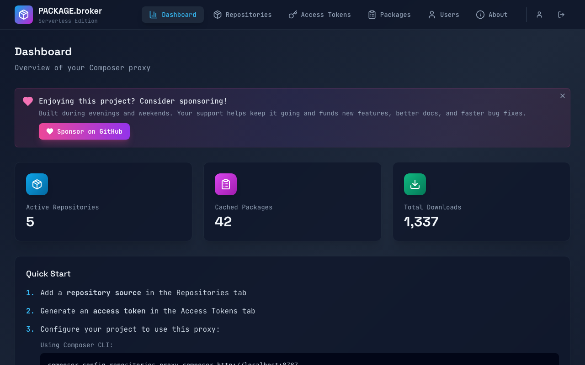
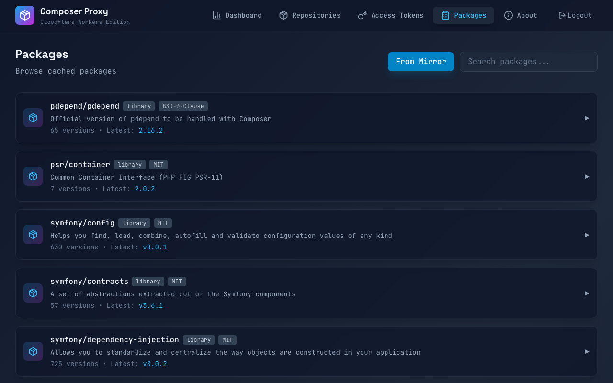
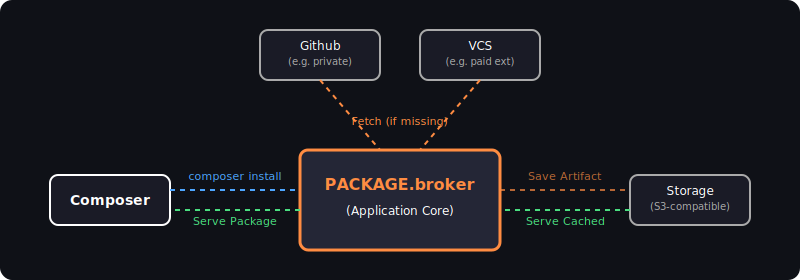

# PACKAGE.broker


[](https://github.com/sponsors/lbajsarowicz)

**Open source Composer repository proxy for private PHP packages**

> Enterprise-grade private package management for PHP — serverless, self-hosted, free.


*(Dashboard View)*


*(Packages List)*

---

## Why This Exists

Managing private Composer packages shouldn't require expensive subscriptions or dedicated servers.

| Problem | Traditional Solution | Cost |
|---------|---------------------|------|
| Private packages | Commercial SaaS | €59-708+/year |
| Self-hosted static | Dedicated VPS | €20-100/month |
| Enterprise repository | Managed server | €50-200/month |

**PACKAGE.broker brings enterprise-grade package proxying to Cloudflare's free tier.**

No servers. No bills. No maintenance. Just `deploy` and forget.

---

## Features Comparison

| Feature | PACKAGE.broker | Commercial SaaS* | Self-Hosted Static* | Enterprise OSS* |
|---------|--------------|------------------|---------------------|-----------------|
| **Hosting Cost** | ✅ Free (CF free tier) | ❌ €59-708+/year | ❌ Server required | ❌ Server required |
| **Private Packages** | ✅ Unlimited | ✅ Unlimited | ✅ | ✅ |
| **Public Mirror** | ✅ | ✅ | ❌ | ✅ |
| **Artifact Caching** | ✅ | ✅ | ❌ | ✅ |
| **Global Edge Network** | ✅ 300+ locations | ❌ Single region | ❌ | ❌ |
| **Dashboard UI** | ✅ | ✅ | ❌ | ✅ |
| **Access Tokens** | ✅ | ✅ | Manual | ✅ |
| **Setup Time** | ~10 minutes | Instant (SaaS) | ~30 min | ~1 hour |
| **Maintenance** | ✅ Zero (serverless) | ✅ Zero (SaaS) | ❌ Manual | ❌ Manual |
| **Composer 2 Optimized** | ✅ | ✅ | ✅ | ✅ |
| **Open Source** | ✅ AGPL-3.0 | ❌ Proprietary | ✅ | ⚠️ Limited |

*\*Compared to commercial Composer repository services. See [Legal Notice](#legal-notice) below.*

---

## Key Advantages

### 💰 Zero Infrastructure Cost

Runs entirely on Cloudflare's generous free tier:
- **Workers**: 100,000 requests/day
- **D1 Database**: 5GB storage
- **R2 Storage**: 10GB for artifacts
- **KV Cache**: 100,000 reads/day

No servers to manage. No bills to pay. No surprises.

### 🌍 Global Edge Performance

Your packages are cached and served from **300+ Cloudflare edge locations** worldwide. Faster `composer install` for distributed teams in Tokyo, Berlin, São Paulo, and everywhere in between.

### 🔒 Enterprise Security Without Enterprise Pricing

- **AES-256-GCM** encrypted credential storage
- **Token-based authentication** with rate limiting
- **Composer 2.x only** — rejects legacy Composer 1.x requests
- Enterprise-grade security features at zero cost.

### 🛠️ True Serverless Architecture

No Docker containers. No Kubernetes. No VM maintenance. Deploy once, Cloudflare handles:
- Automatic scaling
- SSL certificates
- 99.9% uptime SLA
- DDoS protection

---

## Quick Start

### Option 1: Install from GitHub Packages (Recommended)

Install the published packages and deploy in minutes:

```bash
# Create a new project
mkdir my-composer-proxy && cd my-composer-proxy
npm init -y

# Configure npm to use GitHub Packages for @package-broker scope
echo "@package-broker:registry=https://npm.pkg.github.com" >> .npmrc

# Authenticate with GitHub Packages
npm login --scope=@package-broker --registry=https://npm.pkg.github.com

# Install the packages
npm install @package-broker/cli @package-broker/main

# Initialize configuration
npx package-broker init

# Login to Cloudflare
npx wrangler login

# Create Cloudflare resources
npx wrangler d1 create composer-proxy-db
npx wrangler kv:namespace create COMPOSER_KV
npx wrangler r2 bucket create composer-proxy-artifacts

# Update wrangler.toml with the generated IDs

# Apply database migrations
npx wrangler d1 migrations apply composer-proxy-db --remote

# Deploy to Cloudflare
npx wrangler deploy
```

### Option 2: Clone Repository (Development)

For contributing or customizing:

```bash
git clone https://github.com/package-broker/server
cd server
npm install

# Create Cloudflare resources
npx wrangler d1 create composer-proxy-db
npx wrangler kv:namespace create COMPOSER_KV
npx wrangler r2 bucket create composer-proxy-artifacts

# Apply database migrations
npx wrangler d1 migrations apply composer-proxy-db --local

# Deploy to Cloudflare
npx wrangler deploy
```

### Configure Your Project

Add the proxy to your `composer.json`:

```json
{
  "repositories": [
    {
      "type": "composer",
      "url": "https://your-proxy.workers.dev"
    }
  ]
}
```

### Authenticate

Works with the standard `auth.json` format:

```json
{
  "http-basic": {
    "your-proxy.workers.dev": {
      "username": "token",
      "password": "your-token-from-dashboard"
    }
  }
}
```

---

## Use Cases

### 🏢 Small Agencies
Stop paying hundreds per year for commercial hosting. Deploy your own proxy in 10 minutes.

### 🎁 Open Source Maintainers
Distribute premium or sponsor-only packages privately.

### 🏛️ Enterprise Teams
Full control over your package infrastructure with audit trails and compliance features.

### 🛒 Magento / Adobe Commerce
Cache expensive Magento Marketplace downloads. Supports Magento public/private key authentication natively.

---

## 💖 Support This Project

This project is **free and open source**, built with love during evenings and weekends.

If it saves your team money or makes your workflow better, please consider supporting its continued development:

<a href="https://github.com/sponsors/lbajsarowicz">
  
</a>

### Why Sponsor?

- 🚀 **Faster development** of new features
- 🐛 **Priority bug fixes** for sponsors
- 📧 **Direct support** channel
- 💪 **Keep open source sustainable**

**Even $5/month helps keep this project alive!**

---

## Architecture



### Packages

| Package | Description |
|---------|-------------|
| `@package-broker/shared` | Shared types and Zod schemas |
| `@package-broker/core` | Core business logic |
| `@package-broker/ui` | React dashboard |
| `@package-broker/main` | Worker entry point |
| `@package-broker/cli` | CLI initialization tool |

---

## Supported Repository Types

### VCS Types

| Type | Description |
|------|-------------|
| **Git** | GitHub, GitLab, Bitbucket repositories |
| **Composer** | Third-party Composer repositories |

### Credential Types

| Type | Use Case |
|------|----------|
| `http_basic` | Username/password for any HTTP endpoint |
| `github_token` | GitHub Personal Access Token |
| `gitlab_token` | GitLab Personal/Project Access Token |
| `bitbucket_app_password` | Bitbucket App Password |
| `bearer_token` | Generic Bearer token authentication |

---

## Configuration

### wrangler.toml Example

```toml
name = "composer-proxy"
main = "packages/main/src/index.ts"
compatibility_date = "2024-09-23"
compatibility_flags = ["nodejs_compat"]

[vars]
ENCRYPTION_KEY = "your-32-byte-key-base64"  # openssl rand -base64 32

[[d1_databases]]
binding = "DB"
database_name = "composer-proxy-db"
database_id = "your-database-id"

[[kv_namespaces]]
binding = "KV"
id = "your-kv-id"

[[r2_buckets]]
binding = "R2_BUCKET"
bucket_name = "composer-proxy-artifacts"
```

---

## Development

```bash
npm install
npm run typecheck
npm test
npx wrangler dev --local
npm run build
```

---

## License

AGPL-3.0 License — see [LICENSE](LICENSE) for details.

Built with ❤️ using:
- [Cloudflare Workers](https://workers.cloudflare.com/)
- [Hono](https://hono.dev/) — Ultrafast web framework
- [Drizzle ORM](https://orm.drizzle.team/) — Type-safe SQL
- [React](https://react.dev/) + [Tailwind CSS](https://tailwindcss.com/)

---

## Legal Notice

This project is independent and not affiliated with, endorsed by, or sponsored by any commercial Composer repository service or package registry. All trademarks mentioned are the property of their respective owners and are used here for identification and comparison purposes only under fair use.

"Composer" is a trademark of Nils Adermann and Jordi Boggiano. "Cloudflare" is a trademark of Cloudflare, Inc. This project runs on Cloudflare Workers but is not an official Cloudflare product.

---

## Contributing

Contributions are welcome! Please see [CONTRIBUTING.md](CONTRIBUTING.md) for guidelines.

---

<p align="center">
  <a href="https://github.com/sponsors/lbajsarowicz">
    
  </a>
</p>

<p align="center">
  <sub>If this project saves you money, consider supporting its development ☕</sub>
</p>
